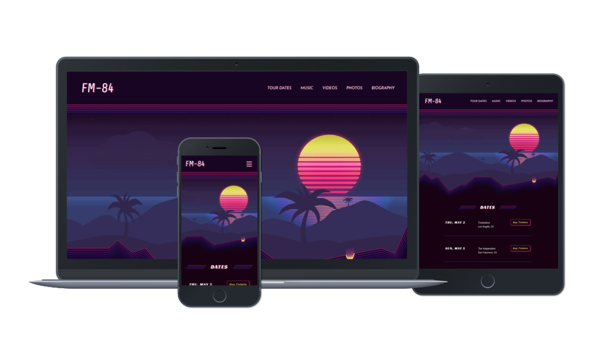

# Synth-Pop Band Website

A static (front-end only) website for an 80s inspired cinematic synth-pop band from California.

[Live Preview](https://synth-band-website.pages.dev/)



## UX

The 80s style inspired band website for the fans of synth-pop music, so they can listen to the audio tracks, watch video clips, check tour dates, buy tickets and sign up for the updates.

To learn more about the needs of the band, please read the [Project Brief](ux/Project_Brief.md) document.

#### Objectives

- Increase online visibility
- Increase fanbase
- Promote music
- Share tour dates
- Build a fan email list

### Users

- Current and potential **Fans**

### Stories

**_"As a fan, I want to listen to band music, so that I can hear the latest tracks."_**

- As a fan, I want to open the album, so that I can start playing the track.
  - [x] Bandcamp embed code
  - [x] Should be flexible size (responsive)
  - [x] Test playback on multiple devices
- As a fan, I want to view the list of albums, so that I can choose which one to listen.
  - [x] Bandcamp embed code
  - [x] List of items using Bootstrap grid
  - [x] Should be flexible size (responsive)
  - [x] Test layout and size on multiple devices

**_"As a fan, I want to purchase music tracks, so that I can support my favourite band."_**

- As a fan, I want to open the album, so that I can click on the Buy Now link.
  - [x] Bandcamp embed code
  - [x] Should be flexible size (responsive)
  - [x] Buy link opens the album on Bandcamp site
  - [x] Test buying process on multiple devices

**_"As a fan, I want to check tour dates, so that I know when they are coming to town."_**

- As a fan, I want to view the list of tour dates, so that I can pick a date.
  - [x] Custom HTML & CSS
  - [x] Display the tour date and the venue
  - [x] Mobile layout option
  - [x] Tablet and larger layout option
  - [x] Test layout on multiple devices
- As a fan, I want to buy tickets to the event, so that I can see my favourite band.
  - [x] Display the button with 'Buy' text
  - [x] On button click open a new tab
  - [x] Custom button styling
  - [x] The button should link to #
  - [x] Test the Buy button on multiple devices

**_"As a fan, I want to view photos, so that I can see cool moments of the band."_**

- As a fan, I want to view the list of photos, so that I see what they are up to lately.
  - [x] Latest photography from Instagram
  - [x] Grid of photos using Bootstrap
  - [x] Check the layout and responsiveness on multiple devices
- As a fan, I want to open the photo, so that I can see more details.
  - [x] Link each photo to the original source of the photo
  - [x] Open each photo in new tab

**_"As a fan, I want to play music video clips, so that I can see cool footage."_**

- As a fan, I want to see the list of videos, so that I can pick one to watch.
  - [x] YouTube embed code
  - [x] Should be flexible size (responsive)
- As a fan, I want to play the video, so that I can see and hear my favourite track.
  - [x] Open the video and play in full screen (default on mobile)
  - [x] Open the video and play in small container (desktop mode)
  - [x] Test the video playback on multiple devices

**_"As a fan, I want to follow the band, so that I can receive important updates fast."_**

- As a fan, I want to click on social media icon, so that I can follow the band.
  - [x] Font Awesome icons for each social media account
  - [x] Link each icon to the corresponding account
  - [x] Each link should open a new tab
  - [x] Test on multiple devices

**_"As a fan, I want to sign up for updates, so that I can receive important news about the music and events."_**

- As a fan, I want to enter my email address, so that I can get important updates or offers.
  - [x] Display an email input field
  - [x] Test for incorrect email address using HTML5

## Features

- Valid HTML & CSS
- Made for mobile first
- Browser tested
- Responsive navigation
- Events listing and ticket ordering
- Photo gallery from Instagram
- Bandcamp music player
- SoundCloud music player
- YouTube video player
- Social media follow links
- Newsletter sign up
- Back to Top

_Features to be implemented in the future:_

- Instagram feed

## Structure

To learn about the information architecture and the flow of this application, please view the [Mindmap](ux/v1/Mindmap_v1.png).

## Skeleton

#### Wireframes

_Small:_ [Home](ux/v1/Wireframes/Small/Home.png), [Tour Dates](ux/v1/Wireframes/Small/Tour_Dates.png), [Music](ux/v1/Wireframes/Small/Music.png), [Videos](ux/v1/Wireframes/Small/Videos.png), [Photos](ux/v1/Wireframes/Small/Photos.png), [Biography](ux/v1/Wireframes/Small/Biography.png), [All in One](ux/v1/Wireframes/Small/Wireframe_Small_v1.pdf)

_Medium:_ [Home](ux/v1/Wireframes/Medium/Home.png), [Tour Dates](ux/v1/Wireframes/Medium/Tour_Dates.png), [Music](ux/v1/Wireframes/Medium/Music.png), [Videos](ux/v1/Wireframes/Medium/Videos.png), [Photos](ux/v1/Wireframes/Medium/Photos.png), [Biography](ux/v1/Wireframes/Medium/Biography.png), [All in One](ux/v1/Wireframes/Medium/Wireframe_Medium_v1.pdf)

_Desktop:_ _Slightly modified Medium view_

## Surface

#### Fonts

- Roboto - https://fonts.google.com/specimen/Roboto (Bootstrap default)

- Roboto Condensed - https://fonts.google.com/specimen/Roboto+Condensed

- Share - https://fonts.google.com/specimen/Share

- Racing Sans One - https://fonts.google.com/specimen/Racing+Sans+One

- Josefin Sans - https://fonts.google.com/specimen/Josefin+Sans

#### Colours


#### Design Mockups

_Small:_ [Home](ux/v1/Designs/Small/Home.jpg), [Tour Dates](ux/v1/Designs/Small/Tour_Dates.jpg), [Music](ux/v1/Designs/Small/Music.jpg), [Videos](ux/v1/Designs/Small/Videos.jpg), [Photos](ux/v1/Designs/Small/Photos.jpg), [Biography](ux/v1/Designs/Small/Biography.jpg)

_Medium:_ [Home](ux/v1/Designs/Medium/Home.jpg), [Tour Dates](ux/v1/Designs/Medium/Tour_Dates.jpg), [Music](ux/v1/Designs/Medium/Music.jpg), [Videos](ux/v1/Designs/Medium/Videos.jpg), [Photos](ux/v1/Designs/Medium/Photos.jpg), [Biography](ux/v1/Designs/Medium/Biography.jpg)

_Desktop:_ _Slightly modified Medium view_

## Tech

A list of all of the languages, frameworks and libraries used to construct this project.

- HTML & CSS
- Bootstrap CSS - https://getbootstrap.com
  - Site Navigation and layout for albums and photos
- jQuery - https://jquery.com/
  - Enable the Navbar toggler
  - Back to Top
- Google Fonts - https://fonts.google.com
  - Support non-standard fonts on user browser
- Node - https://nodejs.org
  - CSS compiling using Sass package and Node scripts
- npm - https://www.npmjs.com
  - Package management
- Sass - https://sass-lang.com
  - Compile custom CSS
  - Choose and compile individual Bootstrap CSS parts
  - Ability to use CSS variables
  - Speed up CSS coding
- Font Awesome - https://fontawesome.com
  - Menu and social media icons
- Prettier - https://prettier.io
  - Format the code and speed up the development

## Testing

### UX

The user needs checklist:

- [x] User is able to see the list of tracks and listen to them.
- [x] User is able to pick an album and purchase it on Bandcamp.
- [x] User is able to see the list of upcoming tour dates.
- [x] User is able to see the list of videos and watch them.
- [x] User is able to see the list of photos.
- [x] User is able to follow the band on social networks.
- [x] User is able to sign up for email updates.

### Code

The site was checked with W3C

Run a series of audits against the page using [Google Lighthouse](https://developers.google.com/web/tools/lighthouse/) and generated the performance reports. Please view the initial [Report](ux/v1/Reports/Lighthouse_Report_Before.png) and the [Report](ux/v1/Reports/Lighthouse_Report_After.png) after some of the optimisations were completed. Based on the suggestions I have improved the page loading speed from 1.7s to 1.5s and optimised the accessibility.

### Browsers

Tested on the following browsers:

**Physical devices**

- Chrome 73 / MacOS High Sierra 10 / iMac
- Firefox 66 / MacOS High Sierra 10 / iMac
- Safari 12 / MacOS High Sierra 10 / iMac
- Chrome 70 / Linux Mint 19 / Asus Notebook
- Chrome 73 / iOS 12/ iPhone 6s
- Safari 12 / iOS 12 / iPhone 6s

**Emulators**

- Chrome / Android 6 / Samsung Galaxy S7
- Chrome / Android 4.4 / Galaxy Tab 4 10.1
- Default Browser / Windows Phone 8.1 / Nokia Lumia 930

The emulator testing was done using a free account at https://www.browserstack.com/.

## Deployment

The site is deployed to Cloudflare. To see a working version please go to: [Live Preview](https://synth-band-website.pages.dev/).

To run project locally you do not need any additional software, however if you want to make changes to the Sass files you need to download and install Node from: https://nodejs.org/en/download/.

After the Node installation please follow the steps bellow:

```
$ git clone
$ cd project-name
$ npm install
```

Update the Sass files and run the following command:

```
$ npm run build:sass
```

If you want to generate CSS files each time you edit Sass source files, please use the following command:

```
$ npm run watch:sass
```

The site can be deployed to any static site hosting provider.

I am using Cloudflare because it can automatically deploy the site each time I push my commits to GitHub repository.

To deploy the site to [Cloudflare](https://www.cloudflare.com/) you need to sign up for an account first. Choose the 'New site from Git' option, then pick your online git hosting service provider and grant a permission to access your repository. And it's done! Now each time you commit to GitHub or your preferred service Cloudflare will automatically deploy the site.

## Credits

#### Media

The photos used in this site were obtained from:

- https://www.facebook.com/fm84music/

- https://www.instagram.com/fm84music

- https://www.goodfon.com/user/kipish_fon/

The soundtracks used in this site were obtained from:

- https://fm84.bandcamp.com/

- https://soundcloud.com/fm84

The videos used in this site were obtained from:

- https://www.youtube.com/user/NewRetroWave

- https://www.youtube.com/user/ViolentSuccess

- https://www.youtube.com/channel/UCQEOS714xK3pmvkvMyafPRQ

#### Acknowledgements

Inspiration for the style of this site:

- https://www.goodfon.com/wallpaper/synth-retrowave-synthwave-fon-new-retro-wave-sintveiv-ret-16.html

Help for customising Bootstrap with Sass:

- https://itnext.io/setting-up-a-sass-build-process-aa9fd92fa585
- https://getbootstrap.com/docs/4.3/getting-started/theming/
- https://uxplanet.org/how-to-customize-bootstrap-b8078a011203

Code snippets:

- https://codepen.io/matthewcain/pen/ZepbeR

Other useful resources:

- https://medium.freecodecamp.org/the-complete-guide-to-scss-sass-30053c266b23
- https://stormotion.io/blog/how-to-write-a-good-user-story-with-examples-templates/#what-is-a-user-story
